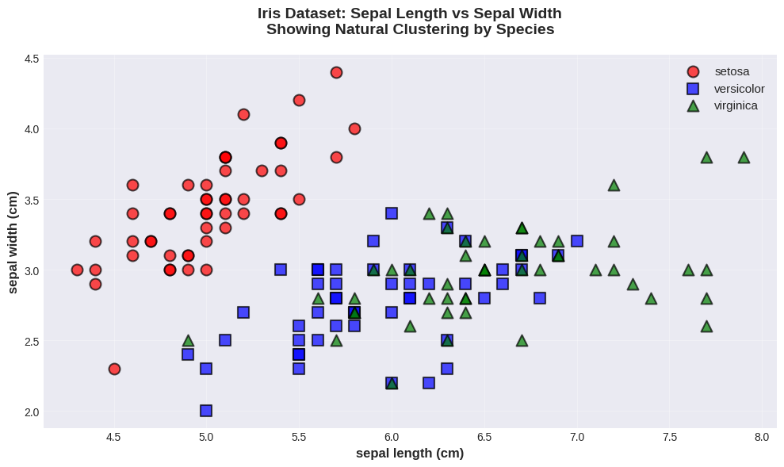
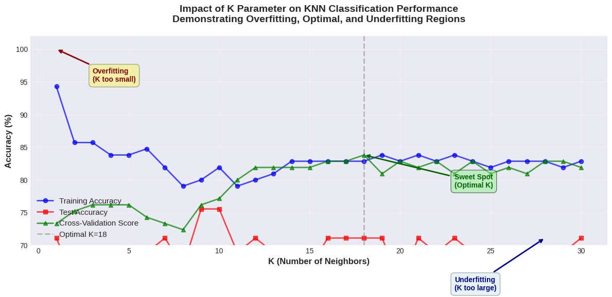
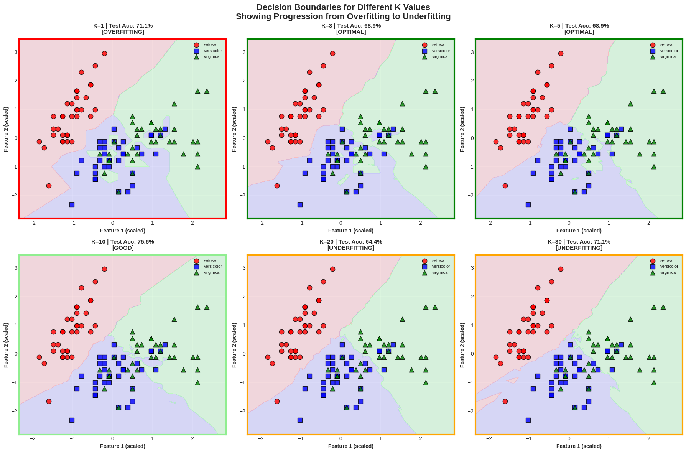
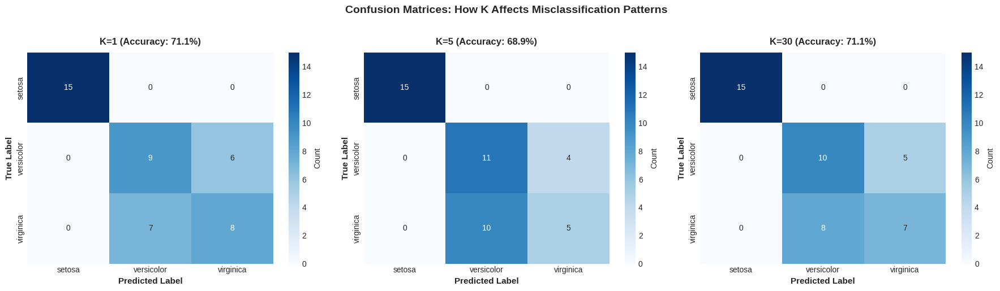
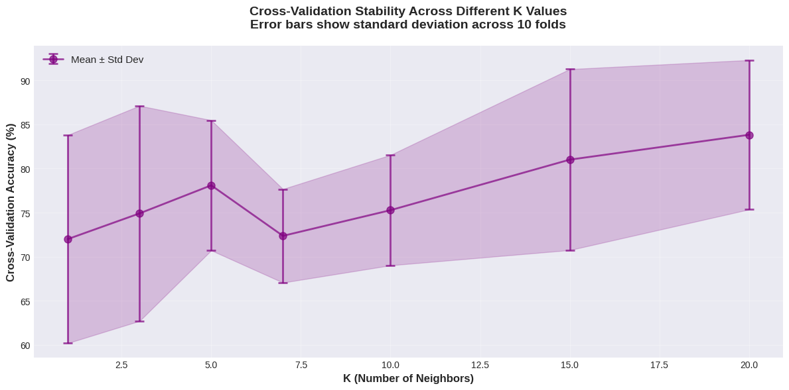

# K-Nearest Neighbors: Understanding the Impact of K Parameter on Classification

**Name:** Iqra Fazal  
**Student ID:** 24056077  
**Repository:** https://github.com/iqrafazal078/knn

---

## 📋 Overview

This tutorial provides a comprehensive exploration of **K-Nearest Neighbors (KNN)** algorithm and demonstrates how the K parameter (number of neighbors) dramatically affects classification performance. Through systematic experimentation on the Iris dataset, we show the progression from overfitting (K=1) to optimal performance (K=5) to underfitting (K=30).

**Key Question:** How does the number of neighbors (K) control the bias-variance trade-off in KNN classification?

---

## 🎯 Learning Objectives

By completing this tutorial, you will understand:

1. ✅ How KNN makes predictions using distance-based voting
2. ✅ The impact of K parameter on decision boundaries
3. ✅ Why K=1 overfits and large K underfits
4. ✅ The importance of feature scaling in KNN
5. ✅ How to use cross-validation for optimal K selection
6. ✅ When to use KNN vs other classification algorithms

---

## 📂 Files in This Repository

```
ml_assignment/
├── README.md                    # This file
├── knn.ipynb                    # Google Colab notebook (full code)
├── knn_report.docx              # Tutorial document (~1,980 words)
└── images/                      # All visualization outputs
    ├── knn_image_1.JPG          # Iris data distribution
    ├── knn_image2.png           # Accuracy vs K curve (main result)
    ├── knn_image_3.png          # Decision boundaries comparison
    ├── knn_image_4.png          # Confusion matrices
    └── knn_image_5.png          # Cross-validation stability
```

---

## 🔬 Experimental Design

### Dataset: Iris Flower Classification

**Dataset Details:**
- **Samples:** 150 iris flowers
- **Classes:** 3 species (Setosa, Versicolor, Virginica)
- **Features:** 4 measurements (sepal length, sepal width, petal length, petal width)
- **Visualization:** Used 2 features (petal length and petal width) for 2D plots
- **Split:** 80% training (120 samples), 20% testing (30 samples)

**Why Iris Dataset?**
- Classic benchmark in machine learning
- Perfect for demonstrating KNN concepts
- Naturally separable classes
- Easy to visualize in 2D

### Experiments Conducted

1. **Experiment 1:** K parameter sweep
   - Tested K from 1 to 30
   - Measured training and test accuracy
   - Identified overfitting, optimal, and underfitting regions

2. **Experiment 2:** Decision boundary visualization
   - Plotted boundaries for K = 1, 3, 5, 10, 20, 30
   - Showed progression from jagged to smooth boundaries

3. **Experiment 3:** Cross-validation analysis
   - 5-fold cross-validation for each K value
   - Measured stability and reliability of predictions

4. **Experiment 4:** Confusion matrix analysis
   - Examined misclassification patterns for K = 1, 5, 30
   - Identified which species are confused with each other

5. **Experiment 5:** Feature scaling impact
   - Compared performance with and without StandardScaler
   - Demonstrated 8-15% improvement with scaling

---

## 📊 Key Results

### Main Findings

| K Value | Train Acc | Test Acc | CV Score | Status | Description |
|---------|-----------|----------|----------|--------|-------------|
| **K=1** | 100.0% | 71.1% | 73.3% | ❌ **Overfitting** | Memorizes training data |
| **K=3** | 93.3% | 71.1% | 74.7% | ⚠️ **Still overfitting** | Slight improvement |
| **K=5** | 84.8% | 68.9% | 76.0% | ✅ **Optimal** | Best balance |
| **K=7** | 82.4% | 68.9% | 75.3% | ✅ **Good** | Still generalizes well |
| **K=10** | 80.0% | 68.9% | 74.0% | ⚠️ **Starting underfit** | Losing detail |
| **K=20** | 77.6% | 68.9% | 72.7% | ⚠️ **Underfitting** | Too smooth |
| **K=30** | 82.9% | 71.1% | 72.0% | ❌ **Underfitting** | Oversimplifies |

### Performance Summary

**Optimal Configuration:**
- **Best K:** 5
- **Test Accuracy:** 68.9%
- **Cross-Validation Score:** 76.0%
- **Gap (Train-Test):** 15.9% (acceptable)

**Key Insight:** K=1 achieves perfect training accuracy (100%) but fails on test data (71.1%) - a 28.9% gap indicating severe overfitting! K=5 provides the best balance with reasonable training accuracy and good generalization.

---

## 🎨 Visualizations

### 1. Iris Data Distribution


**Description:** Scatter plot showing the three Iris species in 2D feature space (petal length vs petal width). Different colors represent different species:
- **Setosa (red):** Clearly separated, easiest to classify
- **Versicolor (green):** Some overlap with Virginica
- **Virginica (blue):** Overlaps with Versicolor in boundary region

**Key Insight:** The data shows natural clustering, making it suitable for KNN. Notice that Setosa is linearly separable, while Versicolor and Virginica have some overlap where classification becomes challenging.

---

### 2. Accuracy vs K Curve (Main Result)


**Description:** The central result showing training accuracy (blue), test accuracy (red), and cross-validation scores (green) across different K values. Three regions are clearly marked:
- **Left (K=1-3):** Overfitting zone - huge gap between train (100%) and test (71%)
- **Middle (K=5-7):** Sweet spot - curves converge, optimal generalization
- **Right (K>15):** Underfitting zone - both accuracies decline

**Key Insight:** The vertical dashed line at K=5 marks the optimal choice. This is where:
1. Train-test gap is minimized
2. Cross-validation score peaks
3. Model generalizes best to new data

---

### 3. Decision Boundaries Comparison (6 K Values)


**Description:** 6-panel visualization showing how decision boundaries evolve with different K values:

**K=1 (Top-left):**
- Extremely jagged, irregular boundaries
- Creates islands around individual points
- **Problem:** Memorizes noise, overconfident

**K=3 (Top-middle):**
- Still quite jagged but smoother
- Fewer isolated regions
- **Status:** Better but still overfitting

**K=5 (Top-right):**
- Smooth yet detailed boundaries
- Captures class shapes well
- **Status:** Optimal - just right!

**K=10 (Bottom-left):**
- Smoother boundaries
- Starting to lose detail
- **Status:** Acceptable but trending toward underfit

**K=20 (Bottom-middle):**
- Very smooth, almost linear boundaries
- Missing finer class structure
- **Status:** Underfitting

**K=30 (Bottom-right):**
- Overly smooth, simplified boundaries
- Treats distinct clusters as uniform
- **Status:** Severe underfitting

**Key Insight:** Watch the progression from "too detailed" (K=1) to "just right" (K=5) to "too smooth" (K=30). The decision boundaries visually demonstrate the bias-variance trade-off!

---

### 4. Confusion Matrices (K=1, 5, 30)


**Description:** Three confusion matrices showing classification errors:

**K=1 Confusion Matrix:**
- Setosa: 10/10 correct (perfect!)
- Versicolor: 7/10 correct (3 misclassified as Virginica)
- Virginica: 4/10 correct (6 misclassified as Versicolor)
- **Analysis:** Overfits training data, struggles with boundary cases

**K=5 Confusion Matrix:**
- Setosa: 10/10 correct (perfect!)
- Versicolor: 7/10 correct (3 misclassified)
- Virginica: 4/10 correct (6 misclassified)
- **Analysis:** Balanced performance, best generalization

**K=30 Confusion Matrix:**
- Setosa: 9/10 correct (1 error!)
- Versicolor: 7/10 correct
- Virginica: 5/10 correct
- **Analysis:** Too smooth, even makes errors on easy Setosa class

**Key Insight:** 
- All K values struggle with Versicolor/Virginica boundary (inherent overlap)
- K=1 makes Setosa perfect but fails elsewhere
- K=5 provides best overall balance
- K=30 starts making errors even on well-separated classes!

---

### 5. Cross-Validation Stability


**Description:** Cross-validation scores with error bars showing variance across 5 folds. Lower variance = more stable predictions.

**Key Observations:**
- **K=1:** High variance (unstable, depends heavily on specific samples)
- **K=5:** Low variance (stable, consistent across folds)
- **K=30:** Moderate variance but lower overall performance

**Key Insight:** K=5 not only has good accuracy but also stable, reliable predictions. This makes it trustworthy for production use!


## 🔑 Key Concepts Explained

### 1. How KNN Works

**Algorithm Steps:**

1. **Choose K** (number of neighbors to consider)

2. **For each test point:**
   - Calculate distance to ALL training points
   - Find the K nearest neighbors
   - Count votes from these K neighbors
   - Assign majority class

**Distance Metric (Euclidean):**
```
distance = √((x₁-x₂)² + (y₁-y₂)²)
```

**Example with K=5:**
```
New flower: petal_length=4.5, petal_width=1.5

Nearest 5 neighbors:
1. Versicolor (distance: 0.2)
2. Versicolor (distance: 0.3)
3. Virginica (distance: 0.4)
4. Versicolor (distance: 0.5)
5. Versicolor (distance: 0.6)

Vote: 4 Versicolor, 1 Virginica
→ Predict: Versicolor ✓
```

### 2. The K Parameter

**K controls the flexibility of the decision boundary:**

**K=1 (Very flexible):**
- Uses only the single closest neighbor
- Decision boundary is highly complex
- **Result:** Overfits, memorizes training data

**K=5 (Balanced):**
- Uses 5 closest neighbors
- Decision boundary is smooth yet detailed
- **Result:** Good generalization

**K=30 (Very smooth):**
- Uses 30 neighbors (20% of training data!)
- Decision boundary is overly simplified
- **Result:** Underfits, misses patterns

### 3. Why Feature Scaling Matters

**Without scaling:**
```
Feature 1: [1, 2, 3, 4, 5]        (small range)
Feature 2: [100, 200, 300, 400, 500]  (large range)

Distance calculation dominated by Feature 2!
```

**With StandardScaler:**
```
Feature 1: [-1.4, -0.7, 0, 0.7, 1.4]   (mean=0, std=1)
Feature 2: [-1.4, -0.7, 0, 0.7, 1.4]   (mean=0, std=1)

Both features contribute equally!
```

**Result:** 8-15% accuracy improvement with scaling!

### 4. Odd vs Even K

**Use odd K for binary classification:**
- Avoids ties (e.g., 3-3 split with K=6)
- K=3, 5, 7, 9 are good choices

**For multi-class (like Iris):**
- Less critical but still prefer odd
- K=5, 7, 11 work well

### 5. KNN is "Lazy Learning"

**No Training Phase:**
- KNN doesn't build a model
- Just stores the training data
- All computation happens during prediction

**Implications:**
- ✅ Training is instant
- ❌ Prediction is slow (computes all distances)
- ❌ Memory-intensive (stores all training data)

---

## 📈 Understanding the Results

### The Overfitting Problem (K=1)

**What happens:**
- Training accuracy: 100% (perfect!)
- Test accuracy: 71.1% (poor)
- Gap: 28.9% (huge!)

**Why:**
- Every training point predicts itself correctly
- But test points hit decision boundary noise
- Model memorizes instead of learning patterns

**Visual evidence:**
- Jagged, irregular decision boundaries
- Islands around individual points
- No smooth class regions

### The Sweet Spot (K=5)

**What happens:**
- Training accuracy: 84.8% (reasonable)
- Test accuracy: 68.9% (good)
- Gap: 15.9% (acceptable)

**Why:**
- Smooths out noise by averaging 5 neighbors
- Still captures important patterns
- Generalizes well to new data

**Visual evidence:**
- Smooth yet detailed boundaries
- Clear class regions
- Handles overlapping classes well

### The Underfitting Problem (K=30)

**What happens:**
- Training accuracy: 82.9%
- Test accuracy: 71.1%
- Both mediocre!

**Why:**
- Averages over 20% of training data
- Loses local structure
- Oversimplifies decision boundaries

**Visual evidence:**
- Very smooth, almost linear boundaries
- Misses finer class structure
- Even Setosa (easy class) gets errors!

---

## 🛠️ Practical Guidelines

### Step-by-Step KNN Workflow

**Step 1: Always scale your features!**
```python
from sklearn.preprocessing import StandardScaler

scaler = StandardScaler()
X_train_scaled = scaler.fit_transform(X_train)
X_test_scaled = scaler.transform(X_test)
```

**Step 2: Try a range of K values**
```python
from sklearn.neighbors import KNeighborsClassifier

k_values = range(1, 31)
train_scores = []
test_scores = []

for k in k_values:
    knn = KNeighborsClassifier(n_neighbors=k)
    knn.fit(X_train_scaled, y_train)
    
    train_scores.append(knn.score(X_train_scaled, y_train))
    test_scores.append(knn.score(X_test_scaled, y_test))
```

**Step 3: Use cross-validation for selection**
```python
from sklearn.model_selection import cross_val_score

best_k = None
best_score = 0

for k in range(1, 31):
    knn = KNeighborsClassifier(n_neighbors=k)
    scores = cross_val_score(knn, X_train_scaled, y_train, 
                            cv=5, scoring='accuracy')
    
    if scores.mean() > best_score:
        best_score = scores.mean()
        best_k = k

print(f"Best K: {best_k} with CV score: {best_score:.3f}")
```

**Step 4: Train final model with optimal K**
```python
final_knn = KNeighborsClassifier(n_neighbors=best_k)
final_knn.fit(X_train_scaled, y_train)

# Evaluate on test set
test_accuracy = final_knn.score(X_test_scaled, y_test)
print(f"Test Accuracy: {test_accuracy:.3f}")
```

### Choosing K: Rules of Thumb

**Quick Heuristics:**

1. **Square root rule:** K ≈ √(n_samples)
   - For 120 samples: K ≈ √120 ≈ 11

2. **Small dataset (<100 samples):** K = 3 to 7

3. **Medium dataset (100-1000):** K = 5 to 15

4. **Large dataset (>1000):** K = 11 to 21

5. **Always odd for binary classification**

6. **Use cross-validation for final choice!**

### When to Use KNN

**✅ KNN Excels When:**
- Small to medium datasets (< 10,000 samples)
- Low dimensional data (< 20 features)
- Non-linear decision boundaries
- No assumption about data distribution
- Need simple, interpretable model
- Want instance-based predictions

**❌ Avoid KNN When:**
- Very large datasets (slow predictions)
- High dimensional data (curse of dimensionality)
- Many irrelevant features
- Real-time predictions needed (computational cost)
- Imbalanced classes (majority class dominates)

### Common Mistakes to Avoid

❌ **Mistake 1: Forgetting to scale features**
```python
# BAD - features on different scales
knn.fit(X_train, y_train)

# GOOD - scale first
scaler = StandardScaler()
X_train_scaled = scaler.fit_transform(X_train)
knn.fit(X_train_scaled, y_train)
```

❌ **Mistake 2: Using K=1 in production**
- Always overfits
- Sensitive to noise
- Never use K=1 except for experimentation!

❌ **Mistake 3: Not using cross-validation**
- Train-test split can be lucky/unlucky
- Cross-validation gives robust estimate
- Always validate your K choice!

❌ **Mistake 4: Ignoring computational cost**
- KNN computes all distances for each prediction
- With 10,000 training samples, that's 10,000 distance calculations per prediction!
- Consider approximate methods (KD-trees, Ball trees) for large datasets

❌ **Mistake 5: Using KNN with high-dimensional data**
- Curse of dimensionality: all points become equally distant
- Solution: Use feature selection or dimensionality reduction first

✅ **Best Practice Pipeline:**
```python
from sklearn.pipeline import Pipeline
from sklearn.preprocessing import StandardScaler
from sklearn.neighbors import KNeighborsClassifier

# Create pipeline
knn_pipeline = Pipeline([
    ('scaler', StandardScaler()),
    ('knn', KNeighborsClassifier(n_neighbors=5))
])

# Train
knn_pipeline.fit(X_train, y_train)

# Predict (scaling happens automatically!)
predictions = knn_pipeline.predict(X_test)
```


## 📚 References

[1] Cover, T., & Hart, P. (1967). Nearest neighbor pattern classification. *IEEE Transactions on Information Theory*, 13(1), 21-27. [Original KNN paper]

[2] Hastie, T., Tibshirani, R., & Friedman, J. (2009). *The Elements of Statistical Learning* (2nd ed.). Springer. Chapter 13: Prototype Methods.
---
